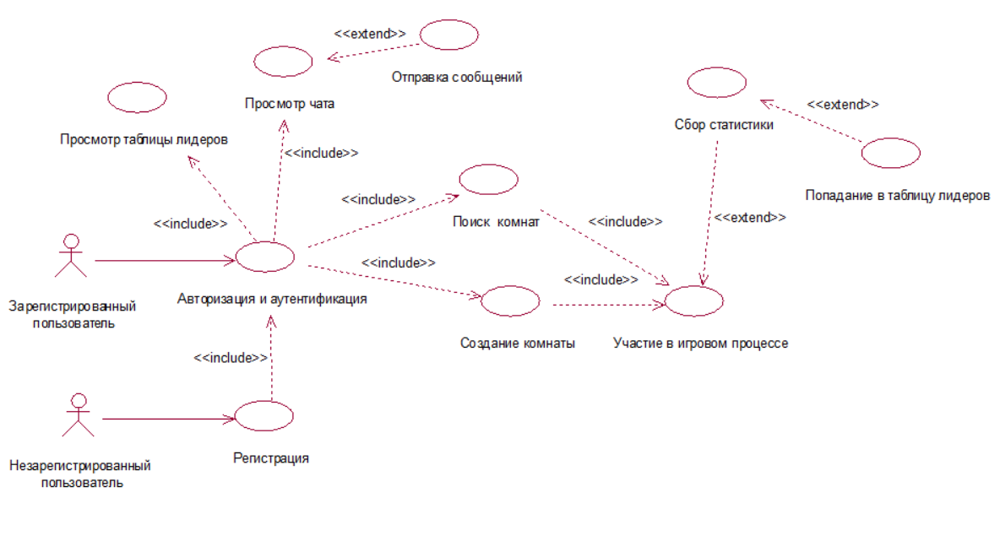
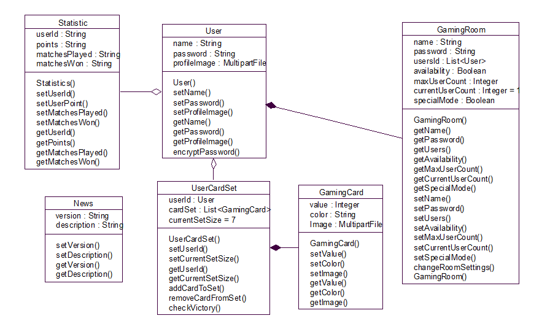
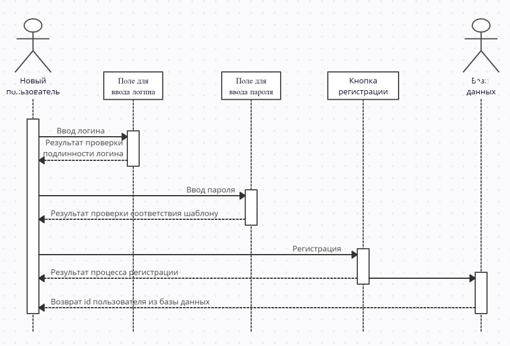
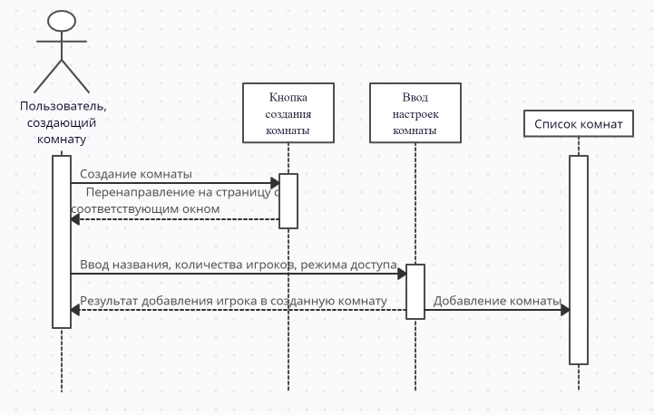

Функциональную модель предметной области представлена в виде диаграммы вариантов использования в нотации UML, представляющей систему в виде набора варианта использования и актеров, взаимодействующих с ними. В рамках предметной области можно выделить двух актеров: зарегистрированный и незарегистрированный пользователи.

В качестве основных классов можно выделить:
-User - класс пользователя с его учетными данными
-Statistic - класс для отображения статистики матчей, доступный только зарегистрированным пользователям
-News - класс для уведомления пользователей о последних новостях и обновлениях
-GamingRoom - класс игровой комнаты, привязнный к создавшему её игроку.
-UserCardSet - класс для контроля текущего набора карт игрока
-GamingCard - класс для создания новой карты

