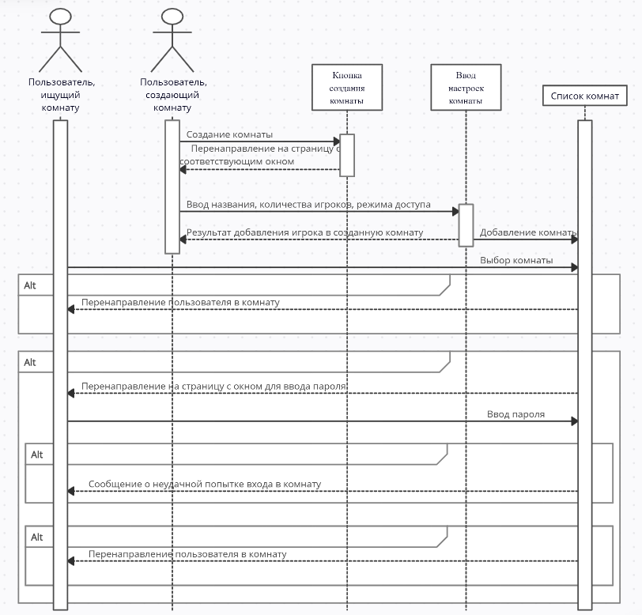

# Построение UML диграммы

Функциональную модель предметной области представлена в виде диаграммы вариантов использования в нотации UML, представляющей систему в виде набора варианта использования и актеров, взаимодействующих с ними. В рамках предметной области можно выделить двух актеров: зарегистрированный и незарегистрированный пользователи.

# Диаграмма классов

В качестве основных классов можно выделить:
1. User - класс пользователя с его учетными данными
2. Statistic - класс для отображения статистики матчей, доступный только зарегистрированным пользователям
3. News - класс для уведомления пользователей о последних новостях и обновлениях
4. GamingRoom - класс игровой комнаты, привязнный к создавшему её игроку.
5. UserCardSet - класс для контроля текущего набора карт игрока
6. GamingCard - класс для создания новой карты

# Диаграмма состояний

После авторизации и аутентификации пользователь попадает в гавное окно и ему доступны следующие переходы:
- чат
- магазин
- таблица лидеров
- список доступных комнат
- окно создания собственной комнаты
  Игрок, создавший или нашедий комнату, попадает в окно игровой комнаты. После завершения игры пользователи возвращаются на главное окно.

# Диаграммы активностей

## Регистрация и вход

# Присоединение к игровой комнате

# Диаграммы последовательностей

## Регистрация

## Создание комнаты

